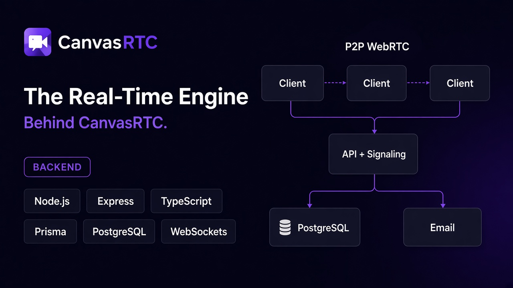

<p align="center">
  
</p>

<h1 align="center">CanvasRTC — Backend</h1>

<p align="center">
  REST API, WebSocket server, and WebRTC signaling for CanvasRTC, a real-time whiteboard with built-in P2P video.
</p>

<p align="center">
  <a href="https://canvas-rtc-fe.vercel.app"><strong>Live demo</strong></a> ·
  <a href="https://github.com/atharvadhumal/canvasRTC-fe"><strong>Frontend repo</strong></a>
</p>

<p align="center">
  
  
  
  
  
</p>

---

## Overview

This service powers the [CanvasRTC frontend](https://github.com/atharvadhumal/canvasRTC-fe). It handles:

- **Authentication**: registration, email verification, login, profile, and password reset
- **Rooms**: create, join by share code, rename, delete, and dashboard listing with live presence
- **Real-time sync**: a WebSocket server that relays whiteboard diffs, cursors, and presence
- **WebRTC signaling**: relays offers, answers, and ICE candidates so browsers connect peer-to-peer. Video and audio never pass through this server.

## Architecture

```text
 Browser ◄──── P2P WebRTC (video/audio) ────► Browser
    │                                            │
    └──── REST + WebSocket ───┐   ┌──────────────┘
                              ▼   ▼
                   Express + WebSocket server
                     │                    │
                     ▼                    ▼
             PostgreSQL (Prisma)     Brevo email API
```

Rooms use a full WebRTC mesh, where each peer connects directly to every other peer. That keeps latency low for small groups, so each room is capped at **4 members** (`Room.maxPeers`).

## Tech stack

| Area | Tools |
| --- | --- |
| Runtime | Node.js, TypeScript, `tsx` for development |
| Server | Express 5, `ws` |
| Database | PostgreSQL on Neon, Prisma 7 with the Neon adapter |
| Auth | JWT, bcrypt |
| Email | Brevo transactional email API (HTTPS) |
| Hosting | Render |

## Getting started

### Prerequisites

- Node.js 20 or newer
- A PostgreSQL database (a free [Neon](https://neon.tech) project works well)
- A [Brevo](https://www.brevo.com) account for verification and password reset emails

### Install and run

```bash
git clone https://github.com/atharvadhumal/canvasRTC-be.git
cd canvasRTC-be
npm install
cp .env.example .env
npx prisma migrate deploy
npm run dev
```

The server listens on `http://localhost:3000`.

### Environment variables

| Variable | Required | Description |
| --- | --- | --- |
| `PORT` | No | HTTP port, defaults to `3000` |
| `DATABASE_URL` | Yes | PostgreSQL connection string |
| `JWT_SECRET` | Yes | Secret for signing tokens. Generate one with `openssl rand -hex 32` |
| `CLIENT_URL` | Yes | Frontend URL used in email links |
| `CLIENT_URLS` | Yes | Comma-separated origins allowed by CORS |
| `BREVO_API_KEY` | Yes | Brevo API v3 key (starts with `xkeysib-`, not the SMTP key) |
| `EMAIL_FROM` | Yes | Verified Brevo sender address |
| `EMAIL_FROM_NAME` | No | Sender display name, defaults to `CanvasRTC` |
| `STUN_URL` | No | STUN server, defaults to Google's public STUN |
| `TURN_URL`, `TURN_USERNAME`, `TURN_CREDENTIAL` | No | TURN relay for peers behind strict NATs |
| `LOG_EMAIL_LINKS` | No | Set to `true` to log verification and reset links in production |

> Email goes through Brevo's HTTPS API rather than SMTP because many free hosting tiers, including Render's, block outbound SMTP ports.

## Scripts

| Command | Description |
| --- | --- |
| `npm run dev` | Start the server with hot reload |
| `npm run build` | Compile TypeScript to `dist/` |
| `npm start` | Run the compiled server |

## API reference

All routes are prefixed with `/api`. Routes marked 🔒 require an `Authorization: Bearer <token>` header.

### Auth — `/api/auth`

| Method | Path | Description |
| --- | --- | --- |
| `POST` | `/register` | Create an account and send a verification email |
| `POST` | `/setup-avatar` | Save the avatar chosen during sign-up |
| `POST` | `/verify-email` | Verify an email address with a token |
| `POST` | `/resend-verification` | Send a new verification email |
| `POST` | `/login` | Sign in and receive a JWT |
| `GET` | `/me` 🔒 | Get the current user |
| `PATCH` | `/me` 🔒 | Update name or avatar |
| `POST` | `/forgot-password` | Send a password reset email |
| `POST` | `/reset-password` | Set a new password with a reset token |

### Rooms — `/api/rooms` 🔒

| Method | Path | Description |
| --- | --- | --- |
| `GET` | `/` | List rooms with live presence. Supports `?filter=owned\|joined` and `?search=` |
| `POST` | `/` | Create a room |
| `POST` | `/join` | Join a room by share code |
| `PATCH` | `/:roomId` | Rename a room |
| `PATCH` | `/:roomId/thumbnail` | Save a board thumbnail for the dashboard |
| `DELETE` | `/:roomId` | Delete a room |

### WebRTC — `/api/ice-config` 🔒

Returns the STUN and TURN servers the client should use for peer connections.

## WebSocket protocol

Clients connect to the server's WebSocket endpoint, authenticate, and join a room by its share code.

| Message | Purpose |
| --- | --- |
| `JOIN_ROOM` | Join a room and receive the current peers |
| `BOARD_SYNC` | Broadcast a whiteboard diff and snapshot |
| `CURSOR_MOVE` | Broadcast a live cursor position |
| `SIGNAL_OFFER`, `SIGNAL_ANSWER`, `ICE_CANDIDATE` | Relay WebRTC signaling between two peers |
| `PING` | Keep the connection alive |

The server closes the socket with these codes when something goes wrong:

| Code | Meaning |
| --- | --- |
| `4001` | Unauthorized |
| `4003` | Forbidden |
| `4004` | Room not found |
| `4008` | Room full (already 4 members) |
| `4000` | Replaced by a newer connection from the same user |

## Data model

| Model | Purpose |
| --- | --- |
| `User` | Account, verification status, avatar |
| `VerificationToken` | Email verification and password reset tokens |
| `Room` | Share code, title, owner, and the `maxPeers` limit |
| `RoomMember` | Membership with a `HOST` or `PARTICIPANT` role |
| `Board` | Latest canvas state and dashboard thumbnail |
| `CanvasSnapshot` | Saved versions of a board |

## Project structure

```text
src/
├── index.ts               Express app, CORS, routes, ICE config
├── wsHandler.ts           WebSocket server: rooms, board sync, cursors, signaling
├── db.ts                  Prisma client with the Neon adapter
├── routes/
│   ├── auth.route.ts      Auth and profile endpoints
│   └── rooms.routes.ts    Room endpoints
├── middleware/
│   └── auth.middleware.ts JWT verification
└── lib/
    ├── mail.ts            Brevo email delivery
    ├── jwt.ts             JWT secret handling
    └── clientUrl.ts       Frontend URL resolution for email links
prisma/
├── schema.prisma          Database schema
└── migrations/            SQL migrations
```

## Deployment

The backend runs on Render as a web service:

- **Build command:** `npm install && npm run build`
- **Start command:** `npm start`
- Set every required environment variable in the Render dashboard, and add your frontend URL to `CLIENT_URL` and `CLIENT_URLS`.
- Run `npx prisma migrate deploy` against the production database after schema changes.

## Contributing

Issues and pull requests are welcome. If you find the project useful, a ⭐ on the [backend](https://github.com/atharvadhumal/canvasRTC-be) and [frontend](https://github.com/atharvadhumal/canvasRTC-fe) repos helps a lot.

## Author

**Atharva Dhumal** · [LinkedIn](https://www.linkedin.com/in/atharvadhumal24) · [GitHub](https://github.com/atharvadhumal)
